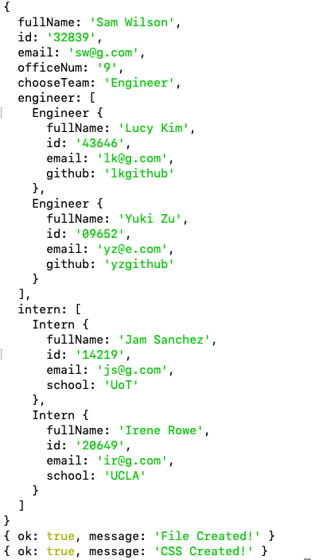

# Team-Profile-Generator

## Description
This is a Node.js command-line application that takes in information about employees on a software engineering team and generates an HTML webpage that displays summaries for each person.

When the application invoked in command-line, users are prompted to

## Built With
* HTML
* CSS
* JavaScript
* Node.js
* NPM
* Inquirer Package
* Jest Testing Framework

## Walkthrough Video

## Usage
Install NPM package:
`
npm install
`
Invoke the app in command-line:
`
node index.js
`

## Contribution
< > with ❤️  by Serena Guo

## Screenshots
HTML generated:

Command-line Interface:

