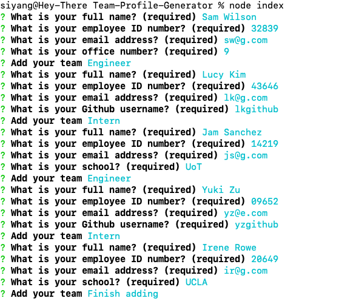

# Team-Profile-Generator

## Description
This is a Node.js command-line application that takes in information about employees on a software engineering team and generates an HTML webpage that displays summaries for each person.

When the application invoked in command-line, users are prompted to enter the team manager’s name, employee ID, email address, and office number. Following that, users are presented with a menu with the option to add an engineer or an intern or to finish building the team. When selecting engineer, users will need to enter the engineer’s name, ID, email, and GitHub username. For interns, intern’s name, ID, email, and school are required to provide. Once finish building the team and exit the application, the HTML is generated. 

## Built With
* HTML
* CSS
* JavaScript
* Node.js
* NPM
* Inquirer Package
* Jest Testing Framework

## Walkthrough Video
[Walkthrough Video](https://drive.google.com/file/d/1h6Sjzvt7lkDTa_Kt3gsYuZgkIuLwfhzS/view)

## Usage
Install NPM package:
`
npm install
`

Invoke the app in command-line:
`
node index.js
`

## Contribution
< > with ❤️  by Serena Guo

## Screenshots
HTML generated:

Command-line Interface:

